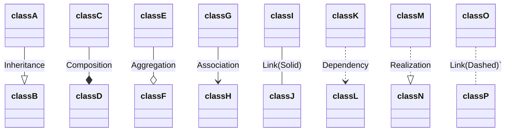

# boschtail

## Backend

> IN PROGRESS
generated with [ent](https://entgo.io/)

## Data model

> IN PROGRESS
better write proper datamodel, e.g. in [mermaid](https://mermaid-js.github.io/mermaid/#/classDiagram)

mixer
- id
- mixer_config_id

mixer_config
- list of ingredient (ordered)

order
- id
- recipe_id
- mixer_id (calculated)

recipe
- id
- list of recipe_ingredient

recipe_ingredient
- id
- ingredient_id
- amount

ingredient
- id
- name

