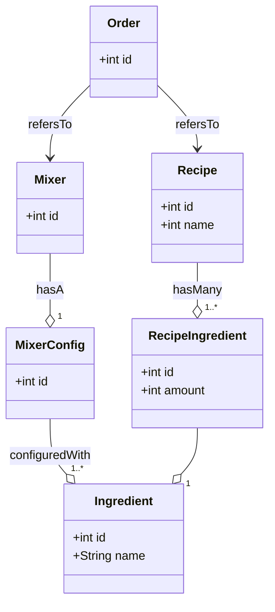

# boschtail

## Backend

> IN PROGRESS
generated with [ent](https://entgo.io/)

## Data model

```mermaid
classDiagram
    Mixer --o "1" MixerConfig : hasA
    MixerConfig --o "1..*" Ingredient : configuredWith
    Order --> Mixer : refersTo
    Order --> Recipe : refersTo
    Recipe --o "1..*" RecipeIngredient : hasMany
    RecipeIngredient --o "1" Ingredient

    Mixer : +int id
    MixerConfig : +int id
    Order : +int id
    Recipe : +int id
    Recipe : +int name
    RecipeIngredient: +int id
    RecipeIngredient: +int amount
    Ingredient: +int id
    Ingredient: +String name
```